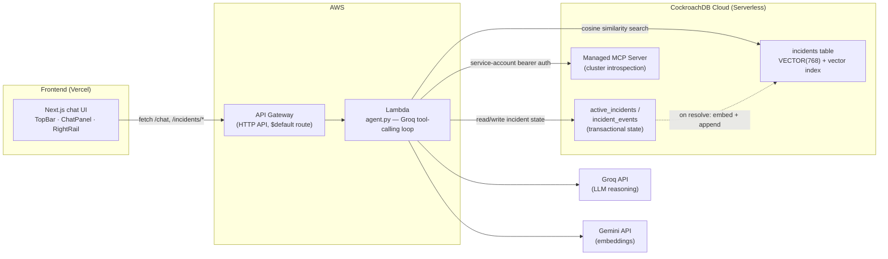

# Continuum

**Institutional memory that never goes down.**

Continuum is an incident copilot for on-call SREs. It recalls semantically
similar past incidents and their resolutions, checks the live health of the
CockroachDB cluster that stores its own memory when an incident looks
database-related, and keeps a transactional log of everything it does so
context survives a reload or a Lambda cold start. When an incident is
resolved, the summary is embedded and folded back into the knowledge base —
the agent's memory grows from what it just handled.

**Live demo:** [continuum-beta-umber.vercel.app](https://continuum-beta-umber.vercel.app/)

Built for the [CockroachDB × AWS Hackathon — Build with Agentic Memory](https://cockroachdb-ai.devpost.com/).

See [DESIGN.MD](DESIGN.MD) for the product/UI design rationale and
[PLAN.MD](PLAN.MD) for the full build log, including bugs found and fixed
along the way.

## Architecture



## What it does

1. An SRE describes symptoms in the chat UI.
2. The agent (Groq, tool-calling) decides whether to search the incident
   knowledge base (`search_similar_incidents`) and/or check the memory
   layer's own live health (`get_cluster_health`) before answering.
3. Every turn is logged to CockroachDB transactionally — reload the page
   or let Lambda cold-start, the incident's state is still there.
4. When the incident is marked resolved, its summary is embedded (Gemini)
   and appended to the knowledge base — the next similar incident will
   find this one too.

## CockroachDB tools used

- **Distributed Vector Indexing** — the `incidents` knowledge base
  (`backend/db/schema.sql`) stores a `VECTOR(768)` embedding per incident
  with a `vector_cosine_ops` index. `backend/src/vector_search.py` embeds
  the live symptom description (Gemini, `RETRIEVAL_QUERY`) and ranks past
  incidents by cosine distance. `scripts/seed_incidents.py` seeds 18
  realistic incidents; resolving a new one (`backend/src/incidents.py:resolve_incident`)
  embeds and appends it back — the knowledge base grows from use.
- **Managed MCP Server** — `backend/src/mcp_tool.py` calls the server's
  `list_clusters`, `get_cluster`, and `show_running_queries` tools over
  JSON-RPC, authenticated with a service-account API key (server-to-server,
  no interactive OAuth) as documented in CockroachDB's MCP quickstart. The
  agent uses this as a live tool during reasoning — e.g. "is the incident
  actually a database problem?" — and the result is surfaced to the SRE
  in the UI's Cluster Health panel.
- **ccloud CLI** — used for cluster provisioning and inspecting cluster
  state during development (CockroachDB Cloud Serverless doesn't expose
  node-level operations to end users by design — see PLAN.MD §9 for what
  that constraint changed about our resilience-demo plan).

## AWS services used

- **AWS Lambda** — runs the agent (`backend/src/handler.py` /
  `backend/src/agent.py`), deployed as a Python 3.12 function built for
  Lambda's Linux runtime from a Windows dev machine (`scripts/build_lambda_package.py`
  cross-compiles dependencies via manylinux wheels — see PLAN.MD Day 6 for
  why that was non-trivial).
- **Amazon API Gateway** — a quick-created HTTP API with a single
  `$default` catch-all route to the Lambda; `handler.py` does its own
  routing from `rawPath`, which is what let deployment stay a single
  boto3 call (`scripts/deploy_lambda.py`) instead of hand-built per-route
  resources.

## Tech stack

| Layer | Choice |
|---|---|
| Frontend | Next.js 16 (App Router, Tailwind v4), deployed on Vercel |
| Backend | Python 3.12 on AWS Lambda |
| LLM reasoning | Groq API (`openai/gpt-oss-120b`) |
| Embeddings | Gemini API (`gemini-embedding-001`, 768 dims) |
| Database | CockroachDB Cloud (Serverless) |

Every external dependency (CockroachDB Serverless, Groq, Gemini, Vercel,
AWS Lambda/API Gateway free tier) runs at **$0** for this project's scale —
see PLAN.MD §5 for the cost breakdown and why Bedrock was deliberately not
used.

## Setup & run

### Prerequisites

- A CockroachDB Cloud Serverless cluster ([free, no card](https://cockroachlabs.cloud/signup))
- API keys: [Groq](https://console.groq.com) (free), [Gemini](https://aistudio.google.com/apikey) (free)
- A CockroachDB Managed MCP service-account key (Cloud Console → Access
  Management → Service Accounts → role `Cluster Operator`)
- An AWS account (for deployment)
- Python 3.12, Node.js 20+

### 1. Configure secrets

```bash
cp .env.example .env
# fill in COCKROACHDB_URL, COCKROACHDB_MCP_SERVICE_ACCOUNT_KEY,
# GROQ_API_KEY, GEMINI_API_KEY, AWS_REGION, AWS_ACCESS_KEY_ID, AWS_SECRET_ACCESS_KEY
```

### 2. Set up the database

```bash
pip install -r backend/requirements-dev.txt
python scripts/apply_schema.py     # creates tables + vector index
python scripts/seed_incidents.py   # seeds 18 realistic past incidents
```

### 3. Run the backend locally

```bash
cd backend/src
uvicorn local_server:app --reload --port 8000
```

### 4. Deploy the backend to AWS

```bash
python scripts/build_lambda_package.py   # cross-compiles deps for Lambda's Linux runtime
python scripts/deploy_lambda.py          # creates/updates the IAM role, Lambda, and HTTP API
```

Prints the live API base URL on success.

### 5. Run the frontend

```bash
cd frontend
npm install
cp .env.local.example .env.local   # set NEXT_PUBLIC_API_BASE_URL to the deployed API URL
npm run dev
```

### 6. Reset demo data (before recording a demo)

```bash
python scripts/reset_demo_data.py
```

### Resilience demo

See [`resilience-demo/README.md`](resilience-demo/README.md) — a 3-node
local CockroachDB cluster (via GitHub Codespaces, no desktop install
required) demonstrating that queries keep succeeding through a node
failure and the cluster self-heals.

## License

[MIT](LICENSE)
