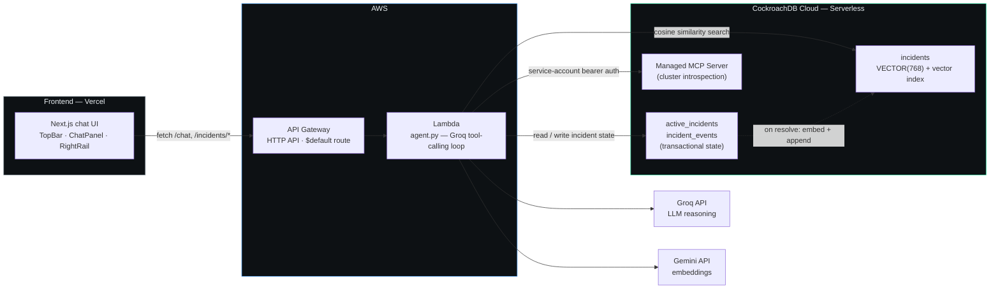
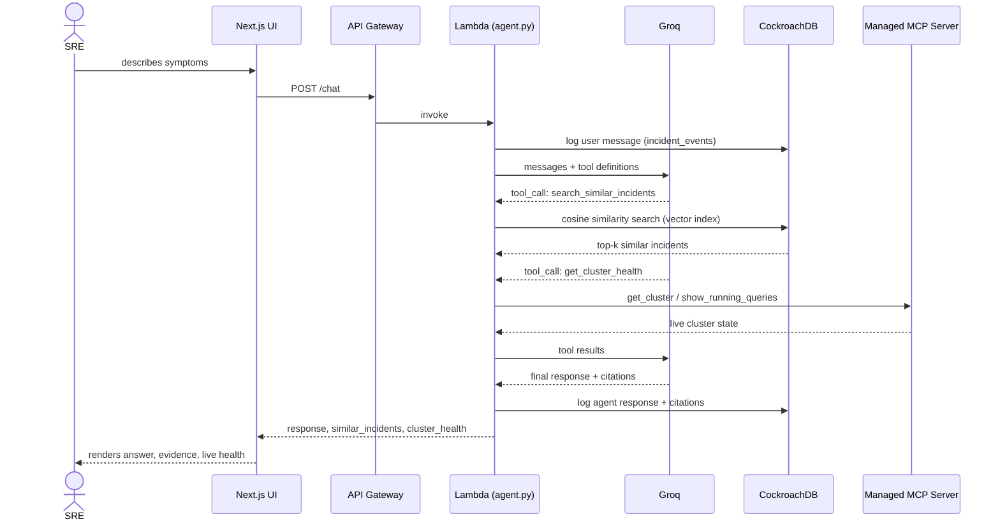
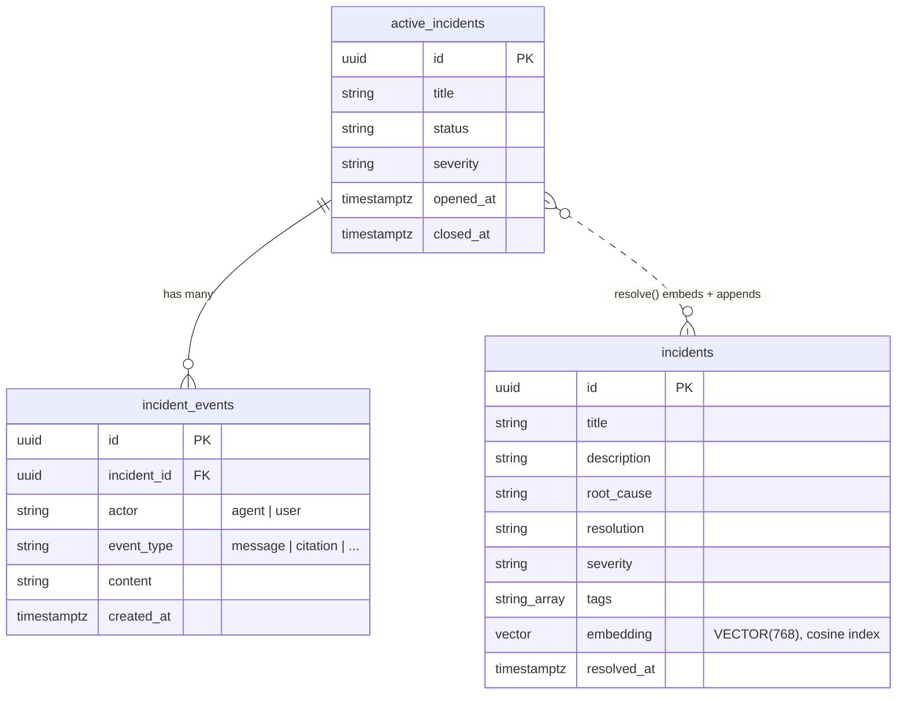

<div align="center">

# Continuum

### Institutional memory that never goes down.

An incident copilot for on-call SREs, built on CockroachDB as a persistent, always-on agentic memory layer.

[](LICENSE)
[](frontend)
[](backend)
[](https://www.cockroachlabs.com/)
[](backend)

**[Live demo](https://continuum-beta-umber.vercel.app/)** · Built for the [CockroachDB × AWS Hackathon — Build with Agentic Memory](https://cockroachdb-ai.devpost.com/)

</div>

---

## Table of contents

- [The problem](#the-problem)
- [What it does](#what-it-does)
- [Architecture](#architecture)
- [Request flow](#request-flow-one-chat-turn)
- [Data model](#data-model)
- [CockroachDB tools used](#cockroachdb-tools-used)
- [AWS services used](#aws-services-used)
- [Tech stack](#tech-stack)
- [Project structure](#project-structure)
- [Setup & run](#setup--run)
- [Resilience demo](#resilience-demo)
- [Cost](#cost)
- [License](#license)

## The problem

AI agents are moving into production workflows — writing code, running
pipelines, diagnosing incidents. But an agent's memory is only as
trustworthy as the database behind it. Most agent memory today is bolted
onto a database that wasn't built for this: it degrades under load, loses
state on failover, and forces a separate vector store to stay in sync with
the operational one.

Continuum is a concrete answer to "what does an agent actually need from
its memory layer, and why does that need CockroachDB specifically?" — an
SRE incident copilot where the memory (past incidents, active state,
semantic search) all lives in one distributed, always-on database, and
where the agent can inspect the health of that database as one of its own
reasoning tools.

## What it does

1. An SRE describes symptoms in the chat UI.
2. The agent (Groq, tool-calling) decides whether to search the incident
   knowledge base or check the memory layer's own live health before
   answering — it isn't hardcoded to always do either.
3. Every turn is logged to CockroachDB transactionally — reload the page,
   or let the Lambda cold-start, and the incident's state is still there.
4. When the incident is marked resolved, its summary is embedded and
   appended to the knowledge base. The next similar incident will find
   this one too — the memory grows from what the agent just handled.

## Architecture



## Request flow (one chat turn)



## Data model



## CockroachDB tools used

| Tool | How it's used |
|---|---|
| **Distributed Vector Indexing** | `incidents` (`backend/db/schema.sql`) stores a `VECTOR(768)` embedding per incident with a `vector_cosine_ops` index. `backend/src/vector_search.py` embeds the live symptom description and ranks past incidents by cosine distance. `scripts/seed_incidents.py` seeds 18 realistic incidents; resolving a new one (`backend/src/incidents.py`) embeds and appends it back — the knowledge base grows from use. |
| **Managed MCP Server** | `backend/src/mcp_tool.py` calls `list_clusters`, `get_cluster`, and `show_running_queries` over JSON-RPC, authenticated with a service-account API key (server-to-server, no interactive OAuth). The agent uses this as a live tool during reasoning — "is this actually a database problem?" — surfaced in the UI's Cluster Health panel. |
| **ccloud CLI** | Cluster provisioning and inspection during development. |

## AWS services used

| Service | How it's used |
|---|---|
| **AWS Lambda** | Runs the agent (`backend/src/handler.py`, `agent.py`) — Python 3.12, deployed via `scripts/build_lambda_package.py` + `scripts/deploy_lambda.py` (cross-compiled for Lambda's Linux runtime, no Docker/AWS CLI required to build the deployment package). |
| **Amazon API Gateway** | A single `$default` catch-all HTTP API route to the Lambda — `handler.py` does its own routing from `rawPath`, so the whole deployment is one idempotent boto3 script. |

## Tech stack

| Layer | Choice |
|---|---|
| Frontend | Next.js 16 (App Router, Tailwind v4) — Vercel |
| Backend | Python 3.12 — AWS Lambda |
| LLM reasoning | Groq (`openai/gpt-oss-120b`), tool-calling |
| Embeddings | Gemini (`gemini-embedding-001`, 768 dims) |
| Database | CockroachDB Cloud — Serverless |

## Project structure

```
.
├── backend/
│   ├── db/schema.sql          # tables + vector index
│   └── src/
│       ├── agent.py           # Groq tool-calling loop
│       ├── handler.py         # Lambda entry point / routing
│       ├── mcp_tool.py        # CockroachDB MCP client
│       ├── vector_search.py   # semantic search over incidents
│       ├── incidents.py       # transactional incident state
│       ├── embeddings.py      # Gemini embedding client
│       ├── db.py              # CockroachDB connection
│       └── local_server.py    # local dev server (mirrors handler.py)
├── frontend/                  # Next.js app
├── scripts/                   # setup, seeding, deployment, demo reset
├── resilience-demo/           # local multi-node resilience demonstration
└── .devcontainer/             # Codespaces config for resilience-demo
```

## Setup & run

### Prerequisites

- A CockroachDB Cloud Serverless cluster ([free, no card](https://cockroachlabs.cloud/signup))
- API keys: [Groq](https://console.groq.com) (free), [Gemini](https://aistudio.google.com/apikey) (free)
- A CockroachDB Managed MCP service-account key (Cloud Console → Access Management → Service Accounts → role `Cluster Operator`)
- An AWS account (for deployment)
- Python 3.12, Node.js 20+

### 1. Configure secrets

```bash
cp .env.example .env
# fill in COCKROACHDB_URL, COCKROACHDB_MCP_SERVICE_ACCOUNT_KEY,
# GROQ_API_KEY, GEMINI_API_KEY, AWS_REGION, AWS_ACCESS_KEY_ID, AWS_SECRET_ACCESS_KEY
```

### 2. Set up the database

```bash
pip install -r backend/requirements-dev.txt
python scripts/apply_schema.py     # creates tables + vector index
python scripts/seed_incidents.py   # seeds 18 realistic past incidents
```

### 3. Run the backend locally

```bash
cd backend/src
uvicorn local_server:app --reload --port 8000
```

### 4. Deploy the backend to AWS

```bash
python scripts/build_lambda_package.py   # cross-compiles deps for Lambda's Linux runtime
python scripts/deploy_lambda.py          # creates/updates the IAM role, Lambda, and HTTP API
```

Prints the live API base URL on success.

### 5. Run the frontend

```bash
cd frontend
npm install
cp .env.local.example .env.local   # set NEXT_PUBLIC_API_BASE_URL to the deployed API URL
npm run dev
```

### 6. Reset demo data (before recording a demo)

```bash
python scripts/reset_demo_data.py
```

## Resilience demo

`resilience-demo/` runs the same CockroachDB version as production
(v26.2.5) as a local 3-node cluster, to make a concrete claim visible:
kill a node, queries keep succeeding on the surviving nodes, restart it,
it rejoins and recovers on its own. This is separate from the production
deployment — CockroachDB Cloud Serverless is fully managed and
intentionally abstracts node-level control away from end users. See
[`resilience-demo/README.md`](resilience-demo/README.md) for exact steps
and a captured sample run.

## Cost

Every dependency runs at **$0** for this project's scale:

| Service | Cost |
|---|---|
| CockroachDB Cloud Serverless | Free tier, no card required |
| Groq API | Free tier, no card required |
| Gemini API | Free tier, no card, no expiry |
| AWS Lambda + API Gateway | Free tier (well within limits) |
| Vercel | Free tier |

## License

[MIT](LICENSE)
